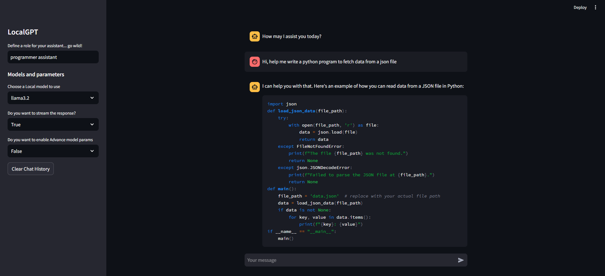

# LocalGPT
A conversational AI powered by [Ollama](https://ollama.com/) & [Streamlit](https://streamlit.io/), built to assist and provide value to users using [local copy of the open source LLM models](https://ollama.com/search).

## Table of Contents

- [Introduction](#introduction)
- [Features](#features)
- [Usage](#usage)
- [Requirements](#requirements)

## Introduction

LocalGPT is a chatbot designed to provide personalized assistance and engage in meaningful conversations. Built using the Ollama & Streamlit library, this bot leverages the idea of running the Large Language models locally.

## Features

* **Conversational AI**: Engage in natural-sounding conversations with our chatbot.
* **Personalized Assistance**: Receive tailored support for various topics and use cases.
* **Role Assignment**: Assign a custom role to the LLM to respond better on the topic.
* **Model Parameters**: Pass model params.

## Usage

To interact with LocalGPT, simply clone the repo, download the libs & models and to start run `streamlit run local_gpt.py`, start a conversation by typing your query or question, assign a role to the assistant, pass params or keep default. You can also provide feedback, suggestions, or report any issues you encounter.

### Example Use Cases

* Ask for information on a specific topic (e.g., "What is the capital of France?")
* Request assistance with a task or problem (e.g., "I need help with math homework.")
* Engage in casual conversation (e.g., "How\'s your day going?")

## Requirements

* **Python 3.8+**: This chatbot is built using Python 3.8 and above.
* **Ollama**: This chatbot uses [Ollama](https://ollama.com/). For custom installation [read Ollama docs](https://github.com/ollama/ollama/tree/main/docs)
* **Local Environment**: Ensure you have a local environment set up with the necessary dependencies.
    * **Streamlit Library**: Install the Streamlit library using pip: `pip install streamlit`
    * **Ollama Library**: Install the Ollama library using pip: `pip install ollama`.
    * **Offline Models**: Download the required models using `ollama run <model_name>` to use in offline mode. For more information [read Ollama docs](https://github.com/ollama/ollama) 

Happy chatting!